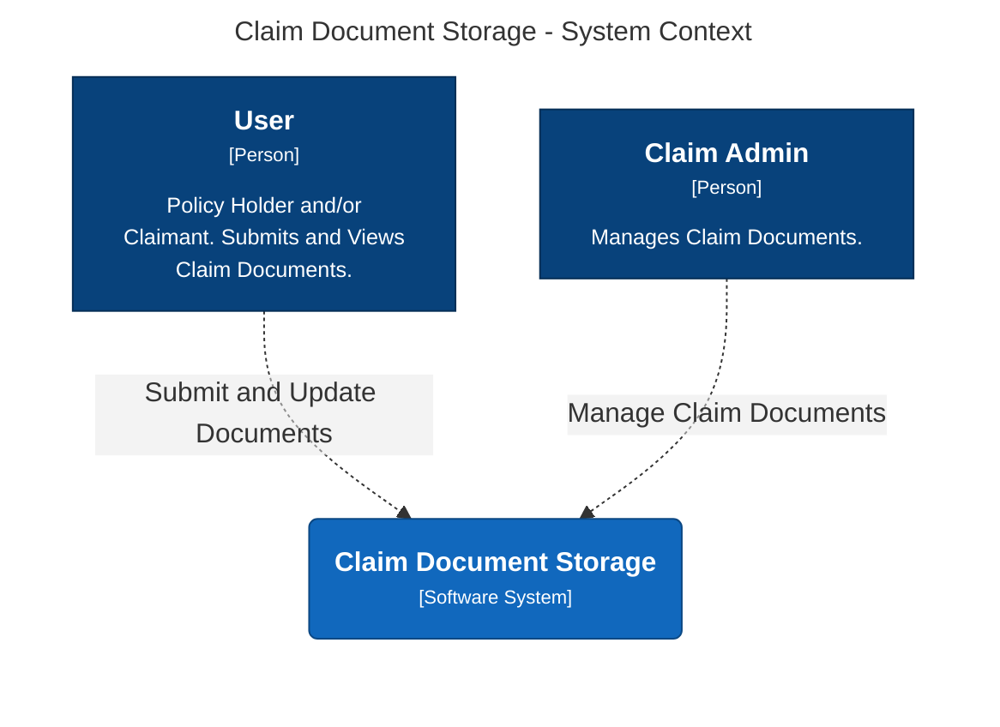
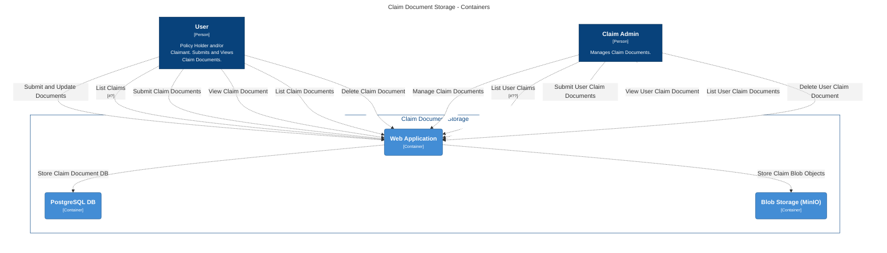
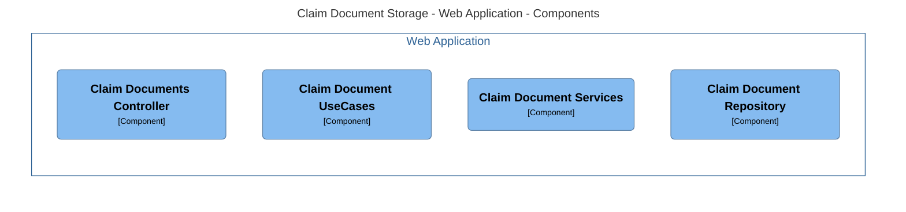
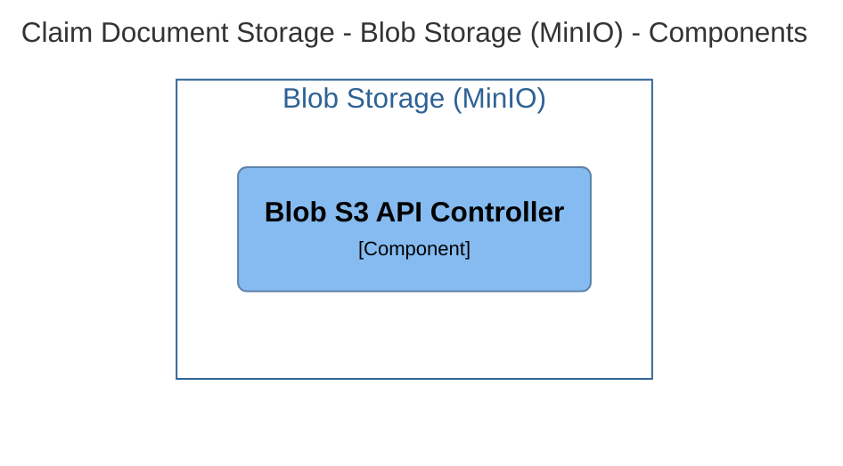
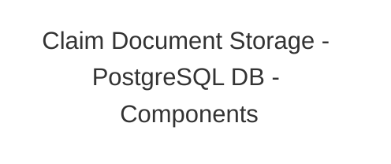
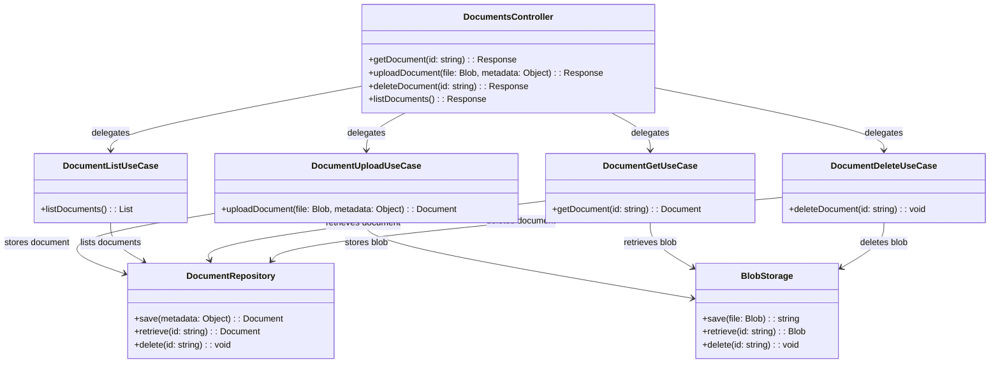
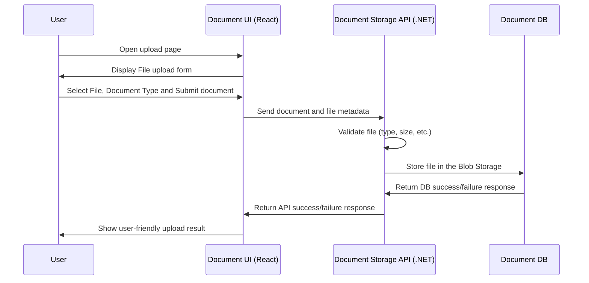
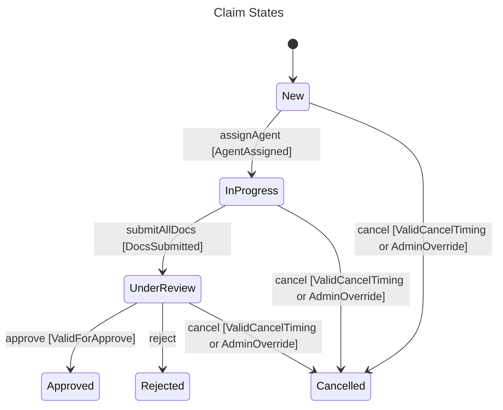

## Claim Document Storage C4 PoC

### System Context

### Containers

### Components

### Class/Code Drafts

#### DocumentController Class PoC

#### File Upload Sequence PoC

#### Claim State PoC

